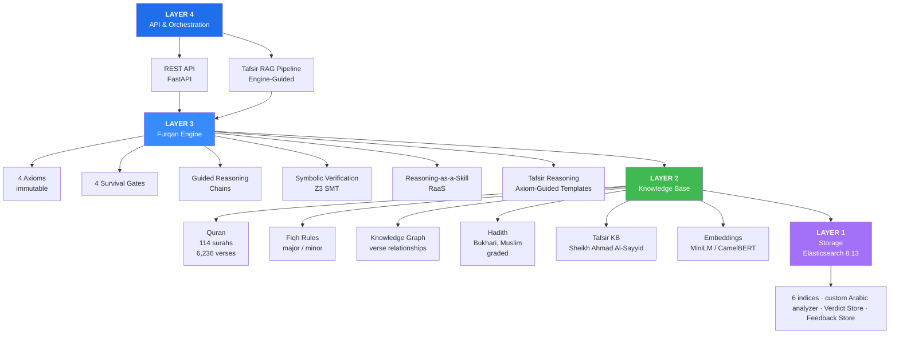
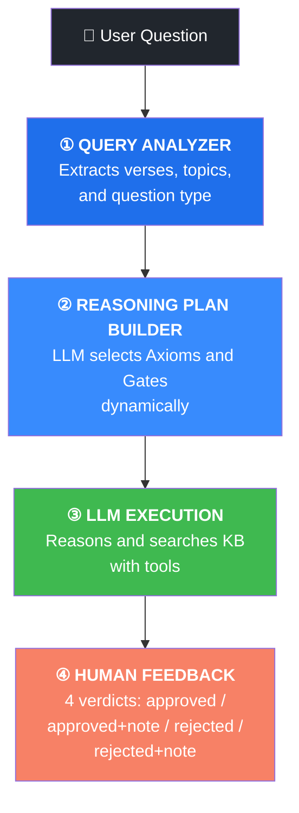
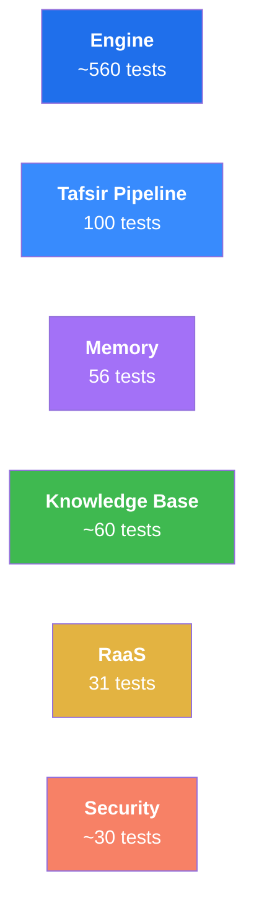

# Al-Furqan (الفرقان) — The Criterion

> Axiom-Anchored Neuro-Symbolic Reasoning Engine with Tafsir Knowledge Base

---

## The Problem

Most AI systems reason by pattern-matching across probability distributions. They aggregate, they hedge, they produce outputs calibrated to what "most sources say." This works for many tasks — but it has a structural flaw: **there is no fixed ground**.

When truth is treated as emergent from data, every conclusion is provisional. Causality becomes correlation. Authority becomes consensus. And the system has no principled way to distinguish a sound argument from a plausible-sounding one.

Al-Furqan is built on a different premise: that **logical necessity, not statistical likelihood**, should govern reasoning. It evaluates ideas, systems, and claims against four immutable axioms through formal verification — using the Islamic Knowledge Base as its verified reference point, because those axioms themselves establish it as the only source that passes all four survival gates.

---

## 🚀 Quick Start

```bash
# 1. Clone and install
git clone https://github.com/your-org/al-furqan.git
cd al-furqan
pip install -e ".[dev]"

# 2. Start Elasticsearch (required for KB and storage)
docker-compose up -d elasticsearch

# 3. Configure your LLM provider
cp .env.example .env
# Set ANTHROPIC_API_KEY, DASHSCOPE_API_KEY, or OLLAMA_HOST

# 4. Start the API
uvicorn src.al_furqan.api.main:app --reload

# 5. Run your first query
curl -X POST http://localhost:8000/reason \
  -H "Content-Type: application/json" \
  -d '{"question": "What does verse 6:5 establish about human cognition?"}'
```

Run the full test suite:

```bash
pytest tests/ -v  # 705 tests
```

---

## 🏗️ Architecture



---

## 🎯 The Four Survival Gates

Every claim — regardless of source, eloquence, or tradition — must pass four sequential gates. A claim that fails any gate is rejected, not hedged.

| Gate | Name | Criterion |
|------|------|-----------|
| 1 | **Source-Integrity** | Is raw truth preserved without reduction? |
| 2 | **Structural-Consistency** | Can the system explain causality without luck? |
| 3 | **Mediation-Zeroing** | Is human cognition treated as finite, not authoritative? |
| 4 | **Origin-Aware** | Does truth trace to a transcendent source? |

**What failure looks like at each gate:**

- **Gate 1 failure:** The system selectively quotes, paraphrases, or reframes the source — changing the claim in the process of transmitting it. Any lossy compression of truth fails here.
- **Gate 2 failure:** The system can describe what happened but not *why*. Correlations presented as causes, outcomes attributed to chance, or circular explanations all fail here.
- **Gate 3 failure:** Human reasoning, consensus, or authority is treated as a terminal source rather than an instrument. The moment a scholar's opinion becomes unfalsifiable, Gate 3 collapses.
- **Gate 4 failure:** The reasoning chain terminates at a contingent origin — a text, a tradition, a person — rather than tracing to a transcendent, self-sufficient source. Systems that bottom out at "because we decided so" fail here.

---

## 🧠 Engine-Guided Tafsir RAG Pipeline

A complete pipeline for Quranic reasoning that teaches the LLM **how to think**, not just what to answer:



### KB Tools (exposed to LLM via function calling)

| Tool | Description |
|------|-------------|
| `search_kb_by_verse("6:5")` | All knowledge graph edges for a verse |
| `search_kb_by_topic("السنة الإلهية")` | Semantic topic search across the KB |
| `search_kb_by_relation("6:5", "LINKED_HADITH")` | Filter by specific relation type |
| `get_verse_context("6:5", range=3)` | Surrounding verses + all KB data |

### Reasoning Templates

Six templates, each dynamically mapped to relevant Axioms and Gates by the LLM at query time:

`TAFSIR` · `VERSE_LINK` · `ISTINBAT` · `COMPARISON` · `SEERAH_LINK` · `GENERAL`

---

## 📚 Knowledge Base

The KB is not limited to Tafsir. **Tafsir is the first validated use case for a general-purpose verified-knowledge framework.** The same ingestion pipeline — transcription → chunking → LLM extraction → human review — is designed to absorb any verified scholarly source: Hadith sciences, Fiqh, Aqeedah, Seerah, Arabic language, Maqasid, contemporary scholarship, and beyond.

**Current state:**
- **First use case:** مدارسة سورة الأنعام — الشيخ أحمد السيد (23 episodes)
- **Ingestion pipeline:** Whisper transcription → chunk → LLM extraction → human review
- **Loaded:** 67 entries (Episode 1), central verses: 6:1, 6:5
- **Structure:** Central verse → linked verses, hadiths, concepts, tafsir nodes
- **Coverage:** 9 Arabic Tafsir books consolidated, 24 episodes transcribed, 2,487 training pairs

---

## 🔬 Symbolic Verification

Z3 SMT solver provides formal mathematical proofs — not heuristics, not confidence scores — for:

- Transcendence Necessity Proof
- Final Court Necessity Proof
- Axiom consistency verification

Formal verification means the engine can distinguish between a claim that is *probably true* and one that is *necessarily true*. That distinction is the foundation of the entire system.

---

## 🛡️ Security

5-layer defense-in-depth:

| Layer | Component | Function |
|-------|-----------|----------|
| 1 | **Prompt Guard** | Injection detection + sanitization |
| 2 | **Axiom Integrity** | SHA-256 hash verification — axioms are immutable |
| 3 | **Output Validator** | Response filtering before delivery |
| 4 | **Adapter Sandbox** | Isolated LLM execution environment |
| 5 | **Audit Logger** | Hashed question logging for traceability |

---

## 📊 Test Coverage



**Total: 705 tests**

---

## 🚀 Roadmap

### ✅ Complete

- Furqan Engine (4 gates, reasoning chains, Z3 verification)
- Knowledge Base (Quran, Hadith, Fiqh, 9 Tafsir books)
- Knowledge Graph (transcript extraction, central verse tracking)
- Security (5-layer defense, axiom integrity)
- Engine-Guided RAG Pipeline (query analysis → reasoning plan → LLM + tools → feedback)
- Human Feedback System (4 verdicts, full context storage)
- Dynamic Axiom/Gate Selection (LLM selects from raw Engine definitions)
- Elasticsearch migration (all core storage — 6 indices with Arabic analyzer)
- Multi-level Quran Tokenizer (5 levels: Word → Root → Semantic → Logic → Transition)
- Lesson pipeline (24 episodes, 2,487 training pairs)
- 705 tests passing

### 🔜 Next (Near-Term)

- [ ] Multi-scholar KB support — expand beyond Sheikh Ahmad Al-Sayyid
- [ ] QLP v3.0 integration (Local-First)
- [ ] Local deployment (vLLM / SGLang)

### 🔮 Horizon

- [ ] Fine-tune Furqan-27B (SFT + DPO on Qwen3.5-27B-Claude-Opus-Distilled)

---

## 📁 Project Structure

```
al-furqan/
├── src/al_furqan/
│   ├── engine/                    # Furqan Engine
│   │   ├── axioms.py              # Immutable axioms + gates
│   │   ├── pipeline.py            # Scan → Mirror → Verdict
│   │   ├── chains/                # Guided reasoning chains
│   │   ├── gates/                 # 4 survival gates
│   │   ├── symbolic/              # Z3 formal verification
│   │   ├── security/              # 5-layer security
│   │   └── tafsir/                # Tafsir reasoning pipeline
│   │       ├── axiom_selector.py
│   │       ├── reasoning_plan_builder.py
│   │       ├── reasoning_templates.py
│   │       ├── pipeline.py        # End-to-end RAG pipeline
│   │       └── feedback.py        # Human feedback system
│   ├── kb/                        # Knowledge Base
│   │   ├── es/                    # Elasticsearch backend
│   │   │   ├── collections.py     # Quran, Hadith collections
│   │   │   ├── graph.py           # ES-backed knowledge graph
│   │   │   ├── retriever.py       # Unified retriever
│   │   │   └── indices.py         # 6 index definitions
│   │   ├── graph/                 # Graph schema
│   │   ├── ingestion/             # Transcript → KB extraction
│   │   └── tafsir/                # Tafsir KB tools
│   │       ├── query_analyzer.py
│   │       ├── kb_tools.py        # 4 search tools for LLM
│   │       └── tool_executor.py
│   ├── tokenizer/                 # Multi-level Quran tokenizer
│   │   ├── encoder.py             # 5-level tokenization pipeline
│   │   ├── schema.py              # Token dataclasses
│   │   ├── morphology.py          # QAC-aware root extraction
│   │   └── semantics.py           # Semantic + logic + transitions
│   ├── providers/                 # LLM providers (Ollama, DashScope, Anthropic, etc.)
│   ├── store/                     # Verdict + feedback storage (ES-backed)
│   └── api/                       # REST API
├── data/
│   ├── quran/                     # Complete Quran text
│   ├── hadith/                    # Hadith collections
│   ├── tafsir/                    # 9 Arabic tafsir books (consolidated)
│   ├── lessons/                   # Transcribed episodes
│   ├── review/                    # Proposed edges (KB)
│   ├── benchmark/                 # Evaluation results
│   └── tafsir_feedback/           # Human feedback entries
├── furqan-raas/                   # Reasoning-as-a-Skill (MCP)
├── furqan-memory/                 # Memory system (MCP)
├── tests/                         # 705 tests
├── scripts/
│   ├── eval/                      # Engine evaluation & A/B testing
│   ├── ingestion/                 # Data prep & KB ingestion
│   ├── benchmarks/                # KB & embedding benchmarks
│   ├── kb_extraction/             # Lesson → knowledge graph
│   └── rendering/                 # Architecture docs to PDF/PNG
└── docs/                          # Documentation
```

---

## 🛠️ Tech Stack

| Layer | Technology |
|-------|------------|
| Language | Python 3.12 |
| LLM Providers | DashScope (Qwen), Anthropic, Ollama, OpenAI-compatible |
| Formal Verification | Z3 SMT Solver |
| Embeddings | MiniLM / CamelBERT |
| Storage (Core) | Elasticsearch 8.13 (6 indices, custom Arabic analyzer) |
| Storage (Memory Skill) | SQLite + ChromaDB (client-side, local-only) |
| API | FastAPI |
| Testing | pytest (705 tests) |
| Transcription | OpenAI Whisper |
| Tokenizer | 5-level Quran tokenizer (Word, Root, Semantic, Logic, Transition) |
| Future Training | LLaMA-Factory + Unsloth (LoRA/QLoRA) |

---

## 📚 Documentation

| Document | Description |
|----------|-------------|
| [Architecture v3.0](docs/active_docs/AL-FURQAN-ARCHITECTURE-v3.0.md) | Complete system architecture |
| [Project Status](docs/active_docs/PROJECT-STATUS.md) | Current state, what's done, what's planned |
| [Elasticsearch Migration](docs/active_docs/ELASTICSEARCH-MIGRATION.md) | ChromaDB/JSON → ES migration |
| [Quran Tokenizer](docs/active_docs/QURAN-TOKENIZER-v1.0.md) | 5-level tokenizer design |
| [RAG Implementation Plan](docs/active_docs/RAG-IMPLEMENTATION-PLAN-v1.0.md) | Engine-Guided RAG pipeline design |
| [Fine-Tuning Plan](docs/active_docs/FINE-TUNING-IMPLEMENTATION-PLAN-v1.0.md) | SFT + DPO plan for Furqan-27B |
| [Security Policy](docs/active_docs/FURQAN-AXIOM-SECURITY-POLICY-v1.0.md) | 5-layer security architecture |
| [RaaS Docs](docs/active_docs/FURQAN-RAAS-DOCS.md) | Reasoning-as-a-Skill |

---

## 📄 License

Apache 2.0

---

*The Code guides. The LLM thinks. Z3 proves. The Knowledge Base knows.*
