# Al-Furqan — The Criterion
## Comprehensive Architecture Document v2.0
### The Single Source of Truth

---

**Project:** Al-Furqan (الفرقان) — Axiom-Anchored Neuro-Symbolic Reasoning Engine
**Version:** 2.0
**Date:** March 20, 2026
**Status:** Approved by CTO
**Repository:** https://gitlab.variiance.com/ai/al-furqan
**Classification:** Internal — Variiance R&D

---

## Table of Contents

1. [Vision & Philosophy](#1-vision--philosophy)
2. [System Overview](#2-system-overview)
3. [Layered Architecture](#3-layered-architecture)
4. [Layer 1: Furqan Engine](#4-layer-1-furqan-engine-الفرقان)
5. [Layer 2: Knowledge Base](#5-layer-2-knowledge-base-المعرفة)
6. [Layer 3: Storage](#6-layer-3-storage-التخزين)
7. [Layer 4: Orchestration & API](#7-layer-4-orchestration--api)
8. [Data Flow](#8-data-flow)
9. [The Axioms (Immutable)](#9-the-axioms-immutable)
10. [The Four Gates](#10-the-four-gates)
11. [Guided Reasoning Chains](#11-guided-reasoning-chains)
12. [Symbolic Verification (Z3)](#12-symbolic-verification-z3)
13. [Knowledge Graph Schema](#13-knowledge-graph-schema)
14. [Cross-Modal Knowledge Linking](#14-cross-modal-knowledge-linking)
15. [Tech Stack](#15-tech-stack)
16. [Sprint Roadmap](#16-sprint-roadmap)
17. [Testing Strategy](#17-testing-strategy)
18. [Dependency Rules](#18-dependency-rules)
19. [Future: Edge & Mobile](#19-future-edge--mobile)
20. [Contingency Plans](#20-contingency-plans)
21. [Research References](#21-research-references)
22. [Contributors](#22-contributors)
23. [Changelog](#23-changelog)

---

## 1. Vision & Philosophy

### 1.1 What is Al-Furqan?

Al-Furqan (الفرقان — "The Criterion") is a **neuro-symbolic reasoning engine** that evaluates ideas, systems, policies, and claims against immutable axioms through formal verification.

It is **NOT** an Islamic chatbot. It is a **general-purpose reasoning engine** that uses the Islamic Knowledge Base as its verified reference point — because the axioms themselves (through the Transcendence Necessity Proof) establish that this is the only source that passes all four survival gates.

### 1.2 Core Principle: LLM as Tongue, Not Brain

```
The LLM speaks.          (extraction, explanation, communication)
The Code thinks.          (scoring, computation, deterministic logic)
Z3 proves.                (formal verification, mathematical proofs)
The Knowledge Base knows. (verified sources, grounded references)
```

### 1.3 Design Principles

1. **Separation of Concerns**: Engine ↔ Knowledge ↔ Storage — never cross-import
2. **Deterministic Judgment**: Same inputs → same score, regardless of LLM model
3. **Source Grounding**: Every claim must trace to a verified source
4. **Formal Verification**: Z3 SMT solver for mathematical proof of consistency
5. **Model Agnostic**: Works with any LLM (Claude, Qwen, Ollama, etc.)
6. **Local-First Ready**: Architecture supports future edge/mobile deployment (QLP v3.0)

---

## 2. System Overview

### 2.1 High-Level Architecture

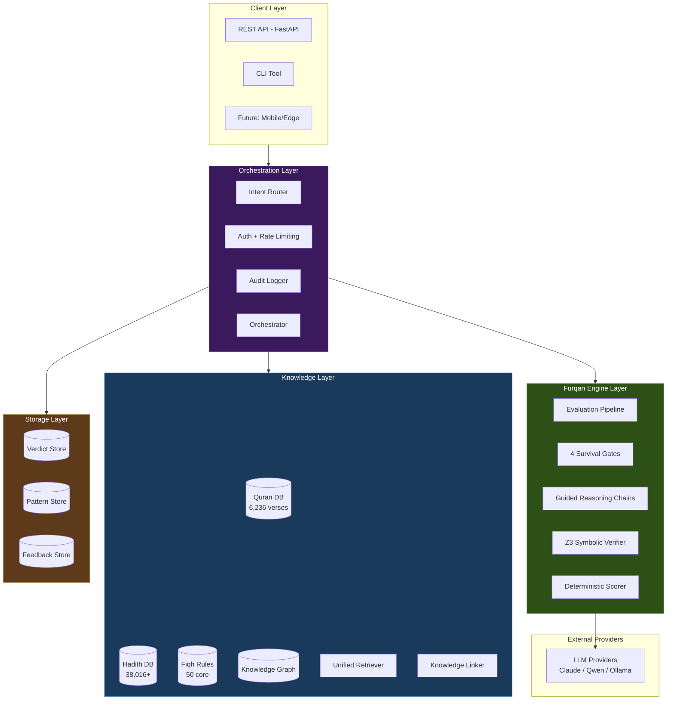

### 2.2 The Golden Rule

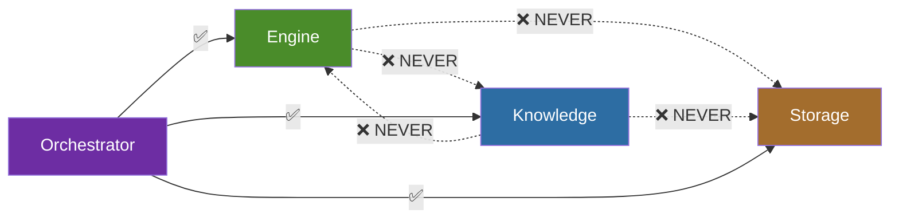

**Only the Orchestrator knows about all layers. No layer imports from another layer.**

---

## 3. Layered Architecture

### 3.1 Layer Overview

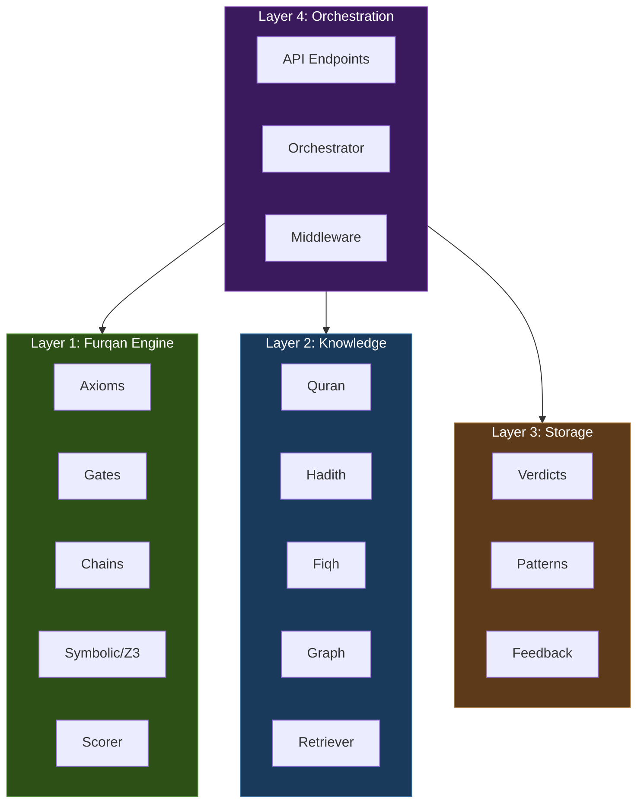

### 3.2 Directory Structure

```
src/al_furqan/
├── engine/                    # Layer 1: Furqan Engine (الفرقان)
│   ├── __init__.py
│   ├── axioms.py              # Immutable axioms
│   ├── models.py              # Verdict, GateScore, etc.
│   ├── pipeline.py            # Scan → Mirror → Verdict → Correct
│   ├── prompts.py             # Prompt templates
│   ├── gates/
│   │   ├── base.py            # Abstract Gate
│   │   ├── source_integrity.py
│   │   ├── structural_consistency.py
│   │   ├── mediation_zeroing.py
│   │   └── origin_aware.py
│   ├── chains/
│   │   ├── definitions.py     # Chain questions per gate
│   │   ├── executor.py        # Chain execution
│   │   └── scorer.py          # Deterministic scoring
│   └── symbolic/
│       ├── formal_axioms.py   # Z3 encoded axioms
│       ├── gate_checks.py     # Z3 gate verification
│       ├── predicate_extractor.py
│       └── verifier.py
│
├── kb/                        # Layer 2: Knowledge (المعرفة)
│   ├── __init__.py
│   ├── embeddings.py          # CamelBERT / ModernBERT
│   ├── retriever.py           # Unified retrieval
│   ├── knowledge_linker.py    # Scholarly reasoning chains
│   ├── cross_reference.py
│   ├── collections/
│   │   ├── quran.py
│   │   ├── hadith.py
│   │   └── fiqh.py
│   ├── graph/
│   │   ├── store.py           # Graph DB connection
│   │   ├── schema.py          # Node/Edge types
│   │   └── traversal.py       # Traversal queries
│   └── ingestion/
│       ├── ingest_quran.py
│       ├── ingest_hadith.py
│       └── ingest_fiqh.py
│
├── store/                     # Layer 3: Storage (التخزين)
│   ├── __init__.py
│   ├── verdict_store.py
│   ├── pattern_store.py
│   ├── feedback_store.py
│   └── audit_log.py
│
├── api/                       # Layer 4: Orchestration
│   ├── __init__.py
│   ├── app.py                 # FastAPI application
│   ├── orchestrator.py        # Connects all layers
│   ├── schemas.py             # Pydantic schemas
│   ├── routers/
│   │   ├── evaluate.py
│   │   ├── verdicts.py
│   │   ├── sources.py
│   │   ├── stats.py
│   │   └── criterion.py
│   └── middleware/
│       ├── auth.py
│       ├── rate_limiter.py
│       └── security.py
│
├── providers/                 # LLM Provider Layer
│   ├── __init__.py
│   └── llm_layer.py           # LiteLLM integration
│
└── config.py                  # Configuration
```

---

## 4. Layer 1: Furqan Engine (الفرقان)

### 4.1 Purpose

Pure reasoning logic. Evaluates anything against axioms and gates. Has **zero knowledge of where data comes from**.

### 4.2 Interface

```python
class FurqanEngine:
    def evaluate(self, question: str, context: str = "") -> Verdict:
        """Context is OPTIONAL. Engine works with or without it."""

    def evaluate_dual(self, question: str, context: str = "") -> DualPerspectiveVerdict:
        """Dual-perspective: system verdict + assumptions verdict."""

    def evaluate_smart(self, question: str, context: str = "") -> Union[Verdict, ...]:
        """Smart routing by intent type."""
```

### 4.3 Evaluation Pipeline

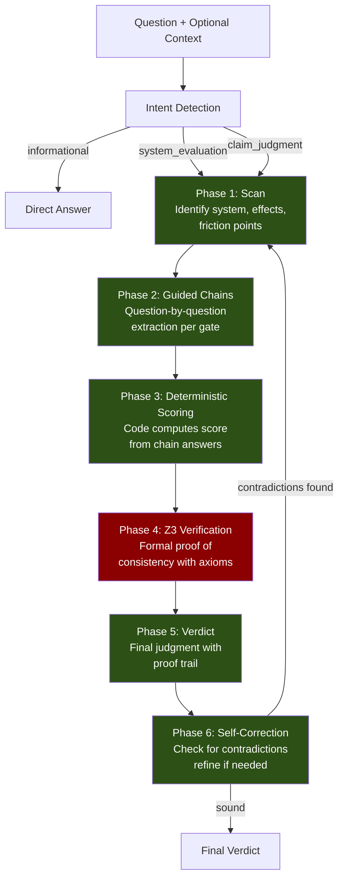

### 4.4 Verdict Data Model

```python
@dataclass
class Verdict:
    question: str
    primary_system: SystemType
    friction_points: list[str]
    gate_scores: list[GateScore]
    origin_gate: GateResult
    consequences_short_term: list[str]
    consequences_long_term: list[str]
    revised_reasoning: str
    final_judgment: str
    total_score: int
    passes: int
    timestamp: float

    # Model tracking (Sprint 3A)
    model_provider: str = ""
    model_name: str = ""
    model_temperature: float = 0.0
    raw_scan_response: str = ""
    raw_mirror_response: str = ""
    raw_verdict_response: str = ""

    # Source citations (Sprint 5)
    source_citations: list[dict] = field(default_factory=list)

    # Symbolic verification (Sprint 4)
    extraction_steps: list[dict] = field(default_factory=list)
    z3_proof: Optional[str] = None
    derivation_method: str = ""
    maqasid_impact: dict = field(default_factory=dict)
```

---

## 5. Layer 2: Knowledge Base (المعرفة)

### 5.1 Purpose

Store and retrieve verified knowledge. Has **zero knowledge of gates, axioms, or scoring**.

### 5.2 Interface

```python
class KnowledgeRetriever:
    def retrieve(self, query: str, config: RetrievalConfig = None) -> KnowledgeContext:
        """Returns relevant sources. Doesn't know how they'll be used."""

    def search(self, query: str, collection: str = "all") -> list[SearchResult]:
        """Direct search across collections."""
```

### 5.3 Collections

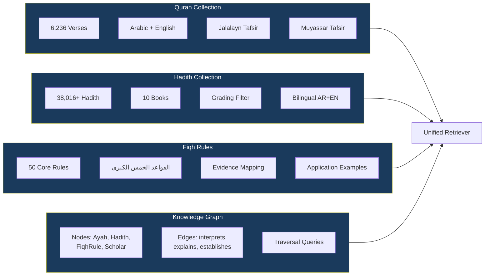

### 5.4 Retrieval Strategy

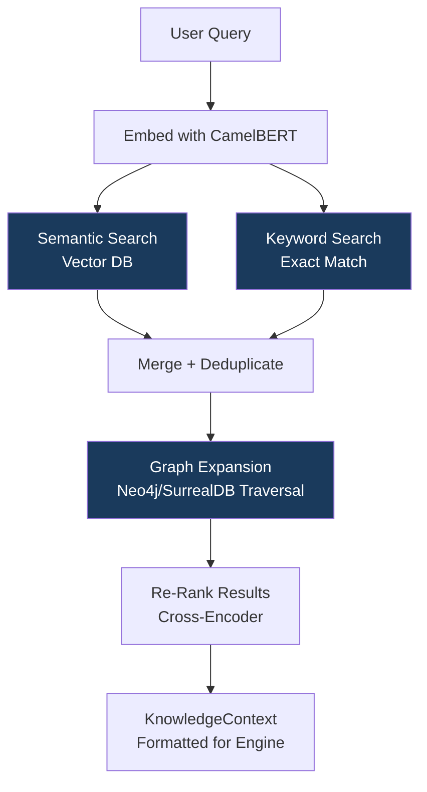

---

## 6. Layer 3: Storage (التخزين)

### 6.1 Purpose

Persist results and history. No business logic, no evaluation.

### 6.2 Components

| Store | Purpose | Format |
|-------|---------|--------|
| VerdictStore | Past verdicts + ChromaDB index | JSON + Vector |
| PatternStore | Successful reasoning patterns | JSON + Vector |
| FeedbackStore | Human corrections and approvals | JSON |
| AuditLog | Full audit trail of all operations | Structured logs |

---

## 7. Layer 4: Orchestration & API

### 7.1 The Orchestrator

```python
class Orchestrator:
    """The ONLY component that knows about all layers."""

    def __init__(self, engine: FurqanEngine,
                 kb: KnowledgeRetriever,
                 store: VerdictStore):
        self.engine = engine
        self.kb = kb
        self.store = store

    def evaluate(self, question: str, use_kb: bool = False) -> Verdict:
        context = ""
        if use_kb:
            kb_result = self.kb.retrieve(question)
            context = kb_result.formatted_text

        verdict = self.engine.evaluate(question, context=context)
        self.store.store(verdict)
        return verdict
```

### 7.2 API Endpoints

| Method | Endpoint | Auth | Description |
|--------|----------|------|-------------|
| GET | `/` | No | Root info |
| GET | `/api/v1/health` | No | Health check |
| POST | `/api/v1/evaluate` | Evaluator+ | Evaluate a question |
| POST | `/api/v1/evaluate-grounded` | Evaluator+ | Evaluate with KB sources (Sprint 5) |
| GET | `/api/v1/verdicts` | Reader+ | List verdicts |
| GET | `/api/v1/verdicts/{id}` | Reader+ | Get verdict by ID |
| DELETE | `/api/v1/verdicts/{id}` | Admin | Invalidate verdict |
| GET | `/api/v1/sources/search` | Reader+ | Search KB (Sprint 5) |
| GET | `/api/v1/stats` | Reader+ | System statistics |

---

## 8. Data Flow

### 8.1 Current Flow (Sprint 2)

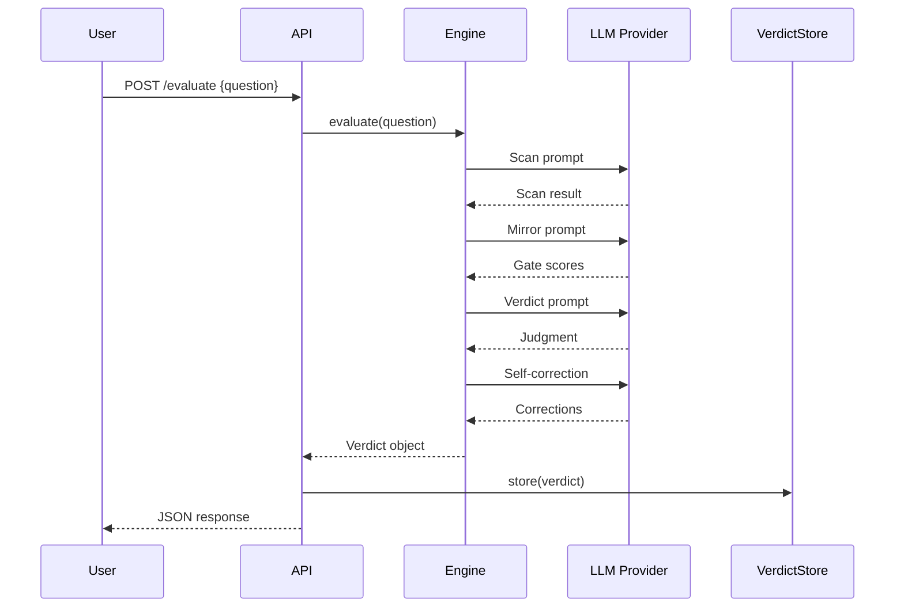

### 8.2 Target Flow (Sprint 5)

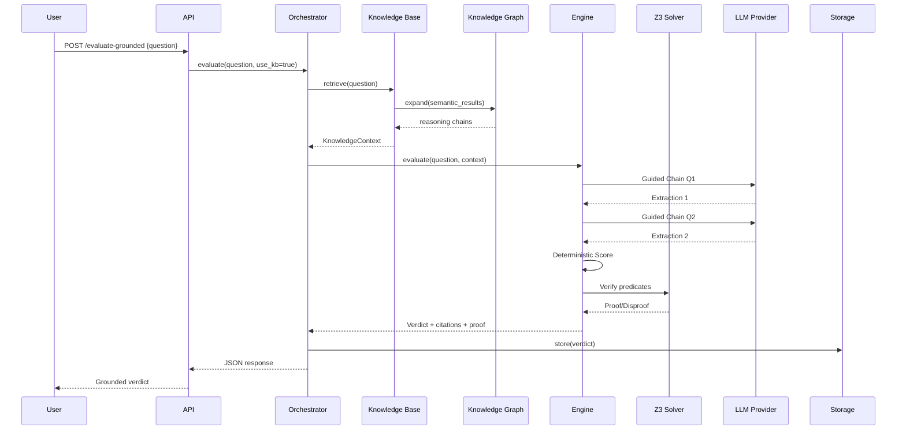

---

## 9. The Axioms (Immutable)

### 9.1 The Three Core Axioms

These are the **immutable foundations** of the system. They do not change. They are not configurable.

```
Axiom 1 — Design Axiom:
  "Existence implies purpose; purpose implies design."
  ∀x: Exists(x) → HasPurpose(x)

Axiom 2 — Network Axiom:
  "Every entity exists in a network of cause and effect."
  ∀x: Exists(x) → HasCausalNetwork(x)

Axiom 3 — Alignment Axiom:
  "Systems must align with their design purpose to function correctly."
  ∀s: System(s) → (Aligned(s, Purpose(s)) ↔ Functional(s))
```

### 9.2 The Two Proofs

```
Proof 1 — Transcendence Necessity:
  "A contingent system cannot ground its own axioms.
   Therefore, an external, non-contingent source is necessary."

Proof 2 — Final Court Necessity:
  "Moral debts exist that human justice cannot resolve.
   Therefore, a final court of accountability is necessary."
```

### 9.3 Z3 Formal Encoding

```python
from z3 import *

Entity = DeclareSort('Entity')
Framework = DeclareSort('Framework')

Exists = Function('Exists', Entity, BoolSort())
HasPurpose = Function('HasPurpose', Entity, BoolSort())
HasTranscendentSource = Function('HasTranscendentSource', Framework, BoolSort())
IsContingent = Function('IsContingent', Framework, BoolSort())

x = Const('x', Entity)
axiom_1 = ForAll([x], Implies(Exists(x), HasPurpose(x)))
```

---

## 10. The Four Gates

### 10.1 Gate Overview

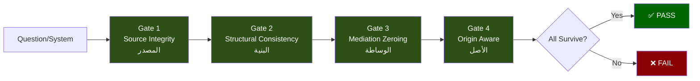

### 10.2 Gate Definitions

| Gate | Name | Question | Survive | Fail |
|------|------|----------|---------|------|
| 1 | Source Integrity | Does this system trace to a verifiable, authoritative source? | Source is divine, prophetic, or empirically verified | Source is fabricated, unverifiable, or mythical |
| 2 | Structural Consistency | Is the system internally consistent and logically coherent? | No contradictions, causal chain intact | Internal contradictions or logical gaps |
| 3 | Mediation Zeroing | Does it rely on human preference as foundation? | Founded on non-human principles | Founded on human opinion/preference |
| 4 | Origin Aware | Does it acknowledge a transcendent origin? | Acknowledges transcendent source | Denies or ignores transcendent origin |

### 10.3 Scoring: Code, Not LLM

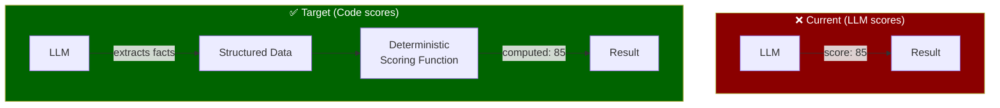

---

## 11. Guided Reasoning Chains

### 11.1 Concept

Each gate is evaluated through a **chain of guided questions** where each answer builds on the previous one. The LLM extracts; the code scores.

### 11.2 Gate 1 Chain Example

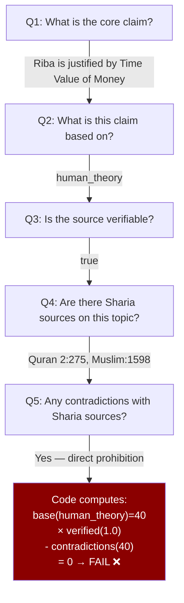

---

## 12. Symbolic Verification (Z3)

### 12.1 Pipeline

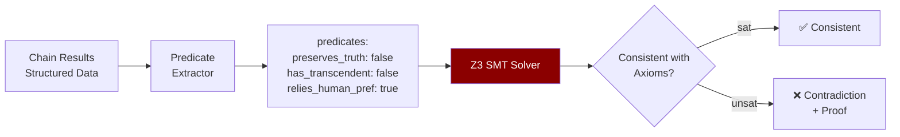

### 12.2 VERGE-Inspired Approach

Based on the VERGE paper (Jan 2026, +18.7% improvement):

1. **Atomic Claim Decomposition**: Break LLM output into individual claims
2. **Autoformalization**: Convert claims to first-order logic
3. **Z3 Verification**: Check consistency with axioms
4. **Minimal Correction Subsets**: If inconsistent, identify exactly which claims to fix
5. **Iterative Refinement**: Fix and re-verify until consistent

---

## 13. Knowledge Graph Schema

### 13.1 Node and Edge Types

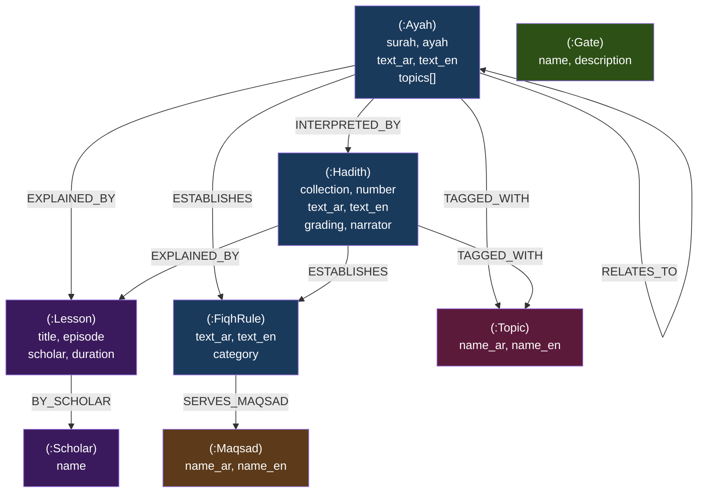

---

## 14. Cross-Modal Knowledge Linking

### 14.1 Concept

When a scholar connects a verse to a hadith and derives a ruling, that **reasoning chain** must be preserved as linked vectors and graph relationships.

### 14.2 Pipeline

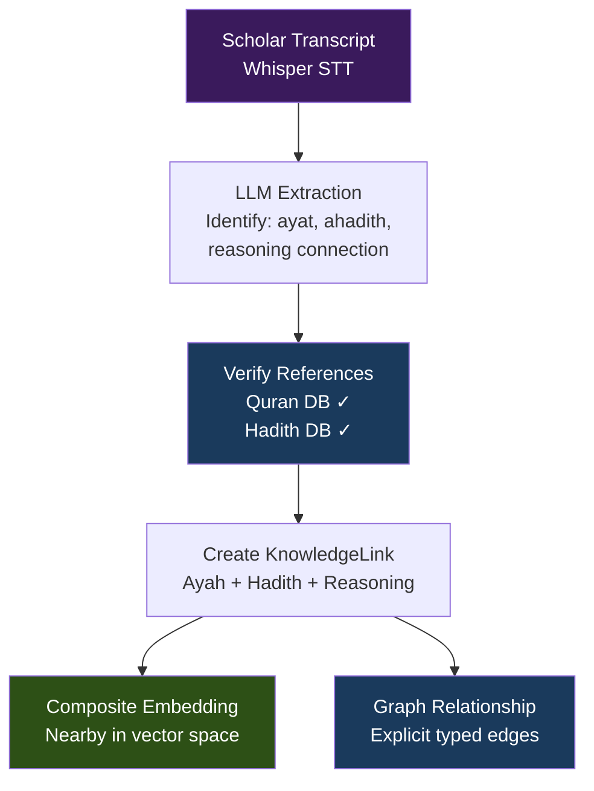

---

## 15. Tech Stack

### 15.1 Current (Sprint 2)

| Component | Technology | Status |
|-----------|-----------|--------|
| API Framework | FastAPI | ✅ Keeping |
| Language | Python 3.10+ | ✅ Keeping (MVP) |
| Vector DB | ChromaDB | 🔄 → Qdrant (Sprint 3) |
| LLM Providers | Custom HTTP per provider | 🔄 → LiteLLM |
| Embeddings | multilingual-MiniLM | 🔄 → CamelBERT/ModernBERT |
| Auth | bcrypt + API keys | ✅ Done (Sprint 2) |
| JSON Parsing | Custom `_repair_json()` | 🔄 → Instructor |
| Tests | pytest | ✅ 205 passing |

### 15.2 Target (Sprint 5)

| Component | Technology | Why |
|-----------|-----------|-----|
| API | FastAPI | Best Python API framework |
| Vector DB | Qdrant | Hybrid search (dense + sparse) |
| Graph DB | SurrealDB or Neo4j | Knowledge Graph (TBD by team) |
| LLM | LiteLLM | 100+ providers, one interface |
| Embeddings | CamelBERT-CA + ModernBERT | Arabic-optimized |
| Symbolic | Z3 SMT Solver | Formal verification |
| Structured Output | Instructor | Pydantic-based, auto-retry |
| Observability | Langfuse (self-hosted) | LLM call tracing |
| STT | faster-whisper large-v3-turbo | 4x faster Arabic transcription |
| Re-ranking | Cross-encoder | Better result ordering |

---

## 16. Sprint Roadmap

### 16.1 Overview

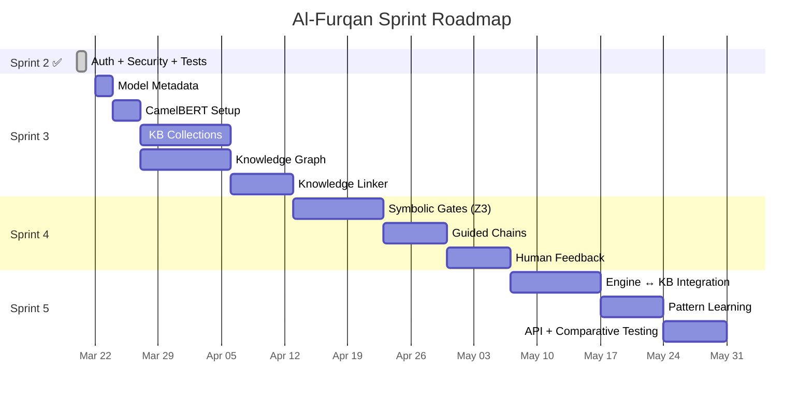

### 16.2 Sprint Details

| Sprint | Focus | Duration | Key Output |
|--------|-------|----------|------------|
| **3** | Infrastructure | 4-5 weeks | KB built, Graph populated, no engine changes |
| **4** | Engine Refinement | 3-4 weeks | Z3 + Chains + Scoring, no KB connection |
| **5** | Integration | 3-4 weeks | Everything connected, comparative testing |

---

## 17. Testing Strategy

### 17.1 Layer Isolation

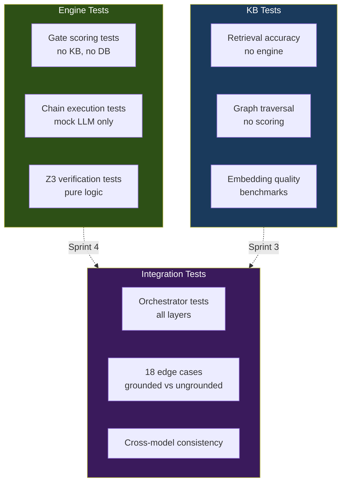

### 17.2 Coverage Targets

| Layer | Target | Current |
|-------|--------|---------|
| Engine (gates, chains, symbolic) | ≥90% | N/A (Sprint 4) |
| KB (retrieval, graph) | ≥85% | N/A (Sprint 3) |
| API + Auth | ≥80% | ✅ 81-100% (Sprint 2) |
| Integration | ≥75% | N/A (Sprint 5) |

---

## 18. Dependency Rules

### 18.1 Import Rules (Enforced)

```
✅ ALLOWED:
  api/ → engine/, kb/, store/           (orchestration)
  engine/ → providers/                   (LLM calls)
  kb/ → (external DBs only)             (data access)
  store/ → (external DBs only)          (persistence)

❌ FORBIDDEN:
  engine/ → kb/                          (engine must not know about KB)
  engine/ → store/                       (engine must not access storage)
  kb/ → engine/                          (KB must not know about engine)
  kb/ → store/                           (KB must not access verdict storage)
  store/ → engine/                       (storage must not evaluate)
  store/ → kb/                           (storage must not retrieve)
```

### 18.2 Data Flow Rules

```
1. Questions flow DOWN (Client → Orchestrator → Engine/KB)
2. Results flow UP (Engine/KB → Orchestrator → Client)
3. ONLY the Orchestrator passes data BETWEEN layers
4. The Engine receives context as a STRING — never a KB object
5. The KB returns results as a CONTEXT object — never a Verdict
```

---

## 19. Future: Edge & Mobile

### 19.1 Local-First Architecture (Sprint 6+, per QLP v3.0)

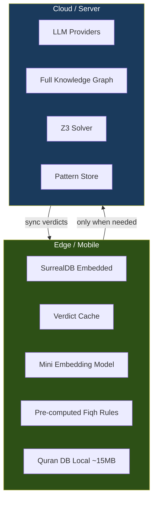

### 19.2 Privacy Model

| Scenario | Data Location | Cloud Call? |
|----------|---------------|-------------|
| Cached question | Edge only | ❌ No |
| Simple Quran search | Edge only | ❌ No |
| Full evaluation | Cloud (LLM) | ✅ Yes (question only) |
| Fiqh rule lookup | Edge only | ❌ No |

---

## 20. Contingency Plans

### 20.1 Overview

Every architectural decision carries risk. This section documents **what could go wrong** with each major component, **early warning signs**, and **pre-planned alternatives** so the team can pivot quickly without redesigning the whole system.

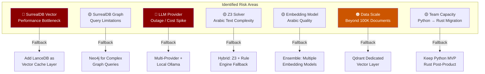

---

### 20.2 Risk 1: SurrealDB Vector Search Performance

**Risk Level:** 🔴 High
**Current Choice:** SurrealDB HNSW for all vector operations
**Dataset:** ~44K documents (Quran 6,236 + Hadith 38,016 + Fiqh 50+)

**What could go wrong:**
- Vector search latency exceeds 200ms per query at scale
- HNSW index rebuild time becomes unacceptable during ingestion
- Lack of quantization options leads to high memory usage
- No sparse vector support limits hybrid search quality

**Early Warning Signs:**
- [ ] Sprint 3 benchmark: SurrealDB vector search > 100ms for top-10 retrieval
- [ ] Memory usage > 2GB for 44K embeddings (768-dim)
- [ ] Hybrid search (vector + FTS) results quality < 0.7 MRR@10

**Contingency Plan A — LanceDB as Vector Cache:**
```
                    ┌─────────────────┐
User Query → │ LanceDB (Vector) │ → top-K results
                    └────────┬────────┘
                             │ document IDs
                    ┌────────▼────────┐
                    │ SurrealDB       │ → graph expansion
                    │ (Graph + Doc)   │ → full context
                    └─────────────────┘
```
- LanceDB handles vector search (embedded, fast, zero-copy)
- SurrealDB handles graph traversal and document storage
- Sync: embeddings indexed in both; LanceDB is read-optimized cache
- **Migration effort:** ~1 week (add LanceDB retriever alongside SurrealDB)
- **Impact on architecture:** Retriever gets a `VectorBackend` abstraction — switch without changing Engine

**Contingency Plan B — Qdrant Dedicated Server:**
- Deploy Qdrant container alongside the API
- Best raw performance, but adds operational complexity
- Reserve for: >500K documents or <20ms latency requirement

**Decision Point:** Sprint 3, Task 3C (KB Collections) — run benchmark before committing.

---

### 20.3 Risk 2: SurrealDB Graph Query Limitations

**Risk Level:** 🟡 Medium
**Current Choice:** SurrealDB `RELATE` + graph traversal via SurrealQL

**What could go wrong:**
- Complex multi-hop traversals (e.g., "find all hadith that explain a verse that establishes a fiqh rule related to a maqsad") become slow or impossible to express in SurrealQL
- Graph query optimizer not mature enough for deep traversals (>3 hops)
- Missing features: no native PageRank, no community detection, no graph algorithms

**Early Warning Signs:**
- [ ] 3-hop graph query > 500ms on populated KB
- [ ] Unable to express required traversal pattern in SurrealQL
- [ ] Missing aggregate functions for graph analysis

**Contingency Plan — Neo4j for Complex Queries:**
```
SurrealDB (primary) ──sync──> Neo4j (read replica for graph queries)
```
- Keep SurrealDB as primary store
- Sync graph relationships to Neo4j for complex Cypher queries
- Use Neo4j only for: path finding, centrality, community detection
- **Migration effort:** ~2 weeks
- **Trigger:** Only if SurrealQL proves insufficient for Sprint 5 integration queries

**Alternative — Custom Graph Algorithms in Python:**
- Implement PageRank, shortest path in Python using NetworkX
- Load subgraph from SurrealDB → process in memory → return results
- Lighter than adding Neo4j, suitable for < 100K nodes

---

### 20.4 Risk 3: LLM Provider Outage or Cost Spike

**Risk Level:** 🔴 High
**Current Choice:** LiteLLM with multiple providers (Claude, Qwen, etc.)

**What could go wrong:**
- Primary provider (Anthropic/OpenAI) has extended outage
- API costs spike unexpectedly (e.g., pricing model change)
- Rate limiting during high-volume evaluation runs
- Provider deprecates model version we depend on

**Early Warning Signs:**
- [ ] >5% API error rate in 24h window
- [ ] Latency increase >3x baseline
- [ ] Monthly cost exceeds budget by >50%

**Contingency Plan — Multi-tier Provider Strategy:**
```
Tier 1 (Primary):     Claude Sonnet / GPT-4o    — best quality
Tier 2 (Fallback):    Qwen 2.5 / Gemini         — good quality, different provider
Tier 3 (Emergency):   Local Ollama (Qwen 14B)   — no external dependency
Tier 4 (Minimal):     Cached patterns only       — no LLM, pattern matching
```

**Implementation (already in LiteLLM):**
```python
# LiteLLM handles failover automatically
response = litellm.completion(
    model="claude-sonnet-4-20250514",
    fallbacks=["qwen/qwen-2.5-72b", "ollama/qwen2.5:14b"],
    messages=[...]
)
```

**Pre-built:** LiteLLM fallback chains are configurable. No code change needed.

---

### 20.5 Risk 4: Z3 Solver — Arabic Text Complexity

**Risk Level:** 🟡 Medium
**Current Choice:** Z3 SMT solver for formal axiom verification

**What could go wrong:**
- Predicate extraction from Arabic text produces noisy/incorrect predicates
- Z3 solver timeout on complex formulas (>30 seconds)
- Edge cases where Z3 returns `unknown` instead of `sat`/`unsat`
- Arabic linguistic ambiguity leads to contradictory predicates

**Early Warning Signs:**
- [ ] Predicate extraction accuracy < 70% on test set
- [ ] Z3 timeout rate > 10% on evaluation queries
- [ ] High rate of `unknown` results

**Contingency Plan A — Hybrid Verification:**
```
Question → Predicate Extraction → Z3 Solver
                                      │
                              ┌───────┴───────┐
                              ▼               ▼
                          sat/unsat        timeout/unknown
                              │               │
                              ▼               ▼
                        Z3 Result      Rule Engine Fallback
                                       (deterministic rules,
                                        no formal proof)
```
- Z3 for cases it can handle (clear predicates, bounded formulas)
- Deterministic rule engine for cases Z3 can't resolve
- Both feed into the scoring function
- **Quality trade-off:** Rule engine gives score but not formal proof

**Contingency Plan B — Simplified Axiom Encoding:**
- Reduce axiom complexity — fewer quantifiers, bounded domains
- Pre-compute common verification patterns as lookup table
- Z3 only for novel/complex cases

---

### 20.6 Risk 5: Arabic Embedding Model Quality

**Risk Level:** 🟡 Medium
**Current Choice:** CamelBERT-CA + ModernBERT-Arabic (to be benchmarked)

**What could go wrong:**
- Arabic embedding models produce poor semantic similarity for Islamic texts
- Classical Arabic (فصحى تراثية) vs Modern Standard Arabic gap
- Quranic text embeddings cluster poorly
- Cross-modal (hadith ↔ verse) similarity scores are unreliable

**Early Warning Signs:**
- [ ] MRR@10 < 0.6 on curated Islamic text retrieval benchmark
- [ ] Quranic verse retrieval accuracy < 80% on known query set
- [ ] Hadith grading correlation < 0.5

**Contingency Plan — Embedding Ensemble:**
```
Query → [CamelBERT] → score_1 ─┐
Query → [ModernBERT] → score_2 ─┤→ Weighted Fusion → Final Score
Query → [BM25/TF-IDF] → score_3 ┘
```
- Multiple embedding models with weighted fusion
- BM25 as keyword backup for exact terminology matches
- **Islamic-specific:** Fine-tune on Quran+Hadith pairs (Sprint 6+ if needed)

**Contingency Plan B — Reranker Pipeline:**
```
Query → Embedding (fast, approximate) → top-50
      → Cross-Encoder Reranker (slow, precise) → top-10
```
- Cross-encoder reranking improves precision significantly
- Already in the architecture plan (Sprint 3)
- If embeddings are weak, rely more on reranker

---

### 20.7 Risk 6: Data Scale Beyond Initial Scope

**Risk Level:** 🟠 Medium-Low (not immediate)
**Current Scope:** ~44K documents
**Future Scope:** Scholar transcripts, tafsir, historical texts → could reach 500K+

**What could go wrong:**
- SurrealDB vector search degrades at >100K documents
- Index rebuild time exceeds acceptable maintenance window
- Memory requirements exceed server capacity

**Early Warning Signs:**
- [ ] Ingestion rate drops below 100 docs/second
- [ ] Query latency grows non-linearly with document count
- [ ] Server memory >80% utilization

**Contingency Plan — Tiered Architecture:**
```
Tier 1: SurrealDB (primary, <100K docs)
    └→ handles: graph, document, FTS, basic vector search

Tier 2: LanceDB/Qdrant (dedicated vector, >100K docs)
    └→ handles: high-volume vector search only

Tier 3: Cold Storage (S3/MinIO)
    └→ handles: archival, raw transcripts, historical data
```

**Trigger:** Only when approaching 100K documents. Not relevant for MVP.

---

### 20.8 Risk 7: Team Capacity — Python to Rust Migration

**Risk Level:** 🟡 Medium (long-term)
**Current Choice:** Python for MVP (team expertise)
**QLP v3.0 Target:** Rust core

**What could go wrong:**
- Team can't learn Rust fast enough for QLP timeline
- Python MVP becomes "permanent" — too much inertia to rewrite
- Performance limitations of Python become blocking

**Early Warning Signs:**
- [ ] No team member comfortable with Rust after 3 months
- [ ] Python hot paths (scoring, embedding) consuming >50% of response time
- [ ] QLP v3.0 timeline approaching with no Rust progress

**Contingency Plan — Incremental Rust via PyO3:**
```
Phase 1: Python MVP (current)
Phase 2: Rust modules via PyO3 (hot paths only)
    - Scoring function → Rust
    - Embedding preprocessing → Rust
    - Z3 bridge → Rust
Phase 3: Full Rust core (QLP v3.0)
```
- PyO3 lets you write Rust functions callable from Python
- Migrate one module at a time — no big-bang rewrite
- Team learns Rust gradually on real production code

---

### 20.9 Contingency Decision Matrix

| Risk | Probability | Impact | Current Mitigation | Trigger to Activate Plan B |
|------|------------|--------|-------------------|---------------------------|
| SurrealDB Vector Perf | Medium | High | Benchmark in Sprint 3 | >100ms per query |
| SurrealDB Graph Limits | Low | Medium | Start simple, test complex queries | Can't express 3-hop query |
| LLM Provider Outage | Medium | High | LiteLLM fallback chains | >5% error rate |
| Z3 Arabic Complexity | Medium | Medium | Hybrid verification design | >10% timeout rate |
| Embedding Quality | Medium | Medium | Multi-model benchmark | MRR@10 < 0.6 |
| Data Scale >100K | Low | Medium | Not needed for MVP | Approaching 100K docs |
| Python → Rust | Low | Low | PyO3 incremental path | QLP timeline pressure |

### 20.10 Architecture Flexibility Points

The layered architecture is **designed** for these pivots:

```
1. Vector Backend    → interface: VectorStore
                     → swap SurrealDB ↔ LanceDB ↔ Qdrant
                     → Engine doesn't know or care

2. Graph Backend     → interface: GraphStore
                     → swap SurrealDB ↔ Neo4j
                     → Retriever doesn't change

3. LLM Provider      → interface: LiteLLM
                     → swap Claude ↔ Qwen ↔ Ollama
                     → zero code change

4. Embedding Model   → interface: EmbeddingModel
                     → swap CamelBERT ↔ ModernBERT ↔ ensemble
                     → re-index required, logic unchanged

5. Symbolic Verifier → interface: Verifier
                     → swap Z3 ↔ rule engine ↔ hybrid
                     → Engine uses same interface
```

**Key Principle:** Every major component has an **interface abstraction**. Swapping implementations is a configuration change, not an architecture change.

---

## 21. Research References

| Paper/Project | Year | Relevance |
|--------------|------|-----------|
| VERGE: Formal Refinement for Verifiable LLM Reasoning | 2026 | LLM + Z3 verification approach |
| Neuro-Symbolic AI in 2024: A Systematic Review | 2025 | 84 citations, comprehensive survey |
| Nucleoid: Logic Language for LLMs | 2026 | Logic Graph runtime |
| Synalinks: Graph-Based Neuro-Symbolic LM Framework | 2026 | Keras-like LM composition |
| ABLkit: Abductive Learning | 2025 | ML + logical reasoning |
| GraphRAG (Microsoft) | 2024 | Knowledge graph + RAG |
| DSPy (Stanford) | 2024 | Declarative LM programming |
| Symbolic AI | Foundation | Original paradigm reference |

---

## 22. Contributors

| Name | Role | Key Contributions |
|------|------|-------------------|
| **Mahmoud Al-Samman** | CTO, Architecture Lead | Architecture decisions, QLP v3.0 vision, final approval |
| **Muhammad Al-Ashmawy** | Research Lead | Symbolic AI, Knowledge Linking, Guided Chains, Roadmap |
| **آية أبوالوفا** | AI Engineer | Gate Decomposition, Knowledge Graph/Neo4j, Fine-tuning strategy |
| **مصطفى مرزوق** | AI Engineer | Symbolic AI research, DSPy analysis, GraphRAG, الجامع analysis |
| **ماجد عارف** | Engineer | Tech stack review, Edge/Mobile proposal, DB comparison |
| **عارف (Arif AI)** | AI Engineering | Implementation, testing, documentation |

---

## 23. Changelog

| Version | Date | Changes |
|---------|------|---------|
| 1.0 | 2026-03-19 | Initial architecture (Sprint 1) |
| 2.0 | 2026-03-20 | Full layered redesign, symbolic layer, knowledge graph, team input |
| 2.1 | 2026-03-20 | Added Section 20: Contingency Plans (7 risks + decision matrix) |

---

_"The engine judges. The knowledge informs. Neither depends on the other."_

_Al-Furqan Architecture v2.0 — March 20, 2026_
_Variiance R&D — The Criterion Project_
